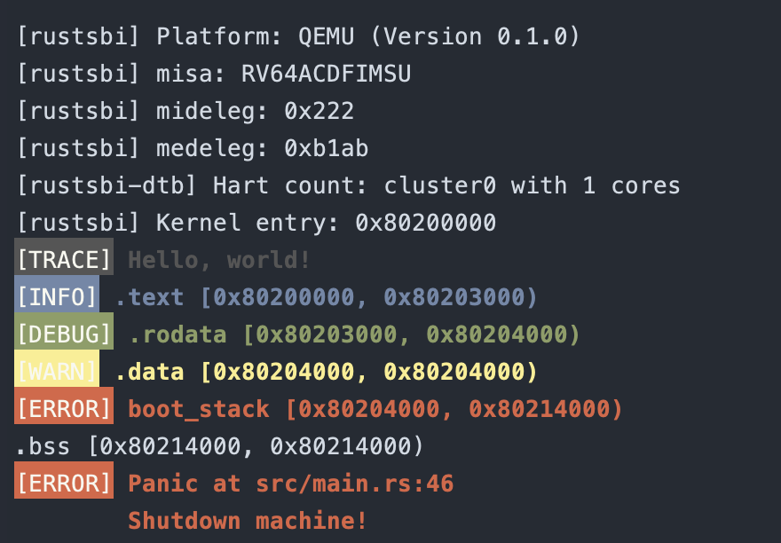

# lab 1

计86 罗境佳 2018013469

## 实验报告

### 本次编程内容

-   实验指导书

    实现了一个能够建立栈空间、清除 `.bss` 段、调用 `rust_sbi` 实现输入/输出/关机并且运行在裸机上的简易 os。

-   编程作业

    利用 ANSI 转义序列实现了命令行的彩色输出。分别实现了 `error!`、`warn!`、`debug!`、`info!`、`trace!` 等 5 个宏，以显示不同的信息。由于 5 个宏的实现又有许多重复的地方，因此在 `console.rs` 中定义了 `impl_color_print!` 宏来减少重复代码。

### 实验效果

## 问答作业

1.  为了方便 os 处理，Ｍ态软件会将 S 态异常/中断委托给 S 态软件，请指出有哪些寄存器记录了委托信息，rustsbi 委托了哪些异常/中断？（也可以直接给出寄存器的值）

    记录委托信息的寄存器：`sstatus`、`sepc`、`scause`、`stval`、`stvec`。

    委托的异常包括：

    -   系统调用（`Trap::Exception(Exception::SupervisorEnvCall)`）
    -   机器软件中断（`Trap::Interrupt(Interrupt::MachineSoft)`）
    -   机器时间中断（`Trap::Interrupt(Interrupt::MachineTimer)`）
    -   非法指令（`Trap::Exception(Exception::IllegalInstruction)`）

2.  请学习 gdb 调试工具的使用（这对后续调试很重要），并通过 gdb 简单跟踪从机器加电到跳转到 0x80200000 的简单过程。只需要描述重要的跳转即可，只需要描述在 qemu 上的情况。

    -   **qemu**
        -   `pc` 初始值为 0x1000，将该值存入 `t0` 寄存器。
        -   给 `a0` 赋值为 `mhartid`，给 `a1` 赋值为 0x1020。
        -   跳转到 `Mem[0x1018]`，具体的值为 0x8000_0000，之后便进入 rust-sbi 的代码部分。
    -   **rust-sbi**
        -   将 `_max_hart_id` 读入 `t0`，如果小于 `mhartid` 则进入 `_start_abort`。
        -   令`sp` 等于 _stack\_start - _hart_stack_size * mhartid。
        -   令 `mscratch` 等于 0。
        -   进入 `main`，进行一些 rust-sbi 的初始化，将 S 的中断委托给 S 态。
        -   从 M 态进入 S 态，运行操作系统

